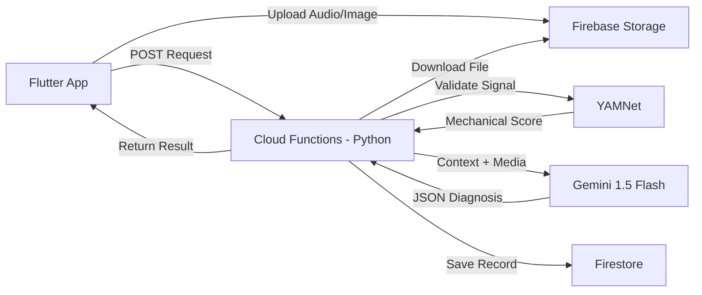

# SonicFix: AI Acoustic Mechanic 🔧🔊

**SonicFix** is an intelligent mobile application that diagnoses mechanical issues by listening to the sound of your machine (car, appliance, etc.). It uses **YAMNet** for real-time signal validation to ensure sound is mechanical, and **Gemini 1.5 Flash** (via Python Cloud Functions) to analyze audio waveforms and provide a detailed diagnosis, including severity, estimated repair costs, and fix steps.


---

## 🏗️ Architecture

The app follows a **Serverless Event-Driven Architecture**:



## ✨ Features

- **Audio Recording**: High-quality audio capture with real-time waveform visualization.
- **AI Diagnosis**:
  - **Problem Identification**: Pinpoints the likely cause (e.g., "Loose Serpentine Belt").
  - **Severity Rating**: Low, Medium, or High priority.
  - **Cost Estimation**: Rough estimate for parts/labor.
  - **Actionable Steps**: Step-by-step guide to fix the issue.
- **Smart Filtering**: Uses **YAMNet** (Machine Learning) to filter out non-mechanical sounds (speech, music) before processing.
- **Multimodal Fallback**: If audio is unclear, the AI requests a **photo**, allowing users to upload visual context for a more accurate diagnosis.
- **Dark Mode**: Sleek, modern Material 3 design.

## 🛠️ Tech Stack

### Frontend (Mobile)
- **Framework**: [Flutter](https://flutter.dev) (Dart)
- **State Management**: [Riverpod](https://riverpod.dev) (NotifierProvider)
- **UI Components**: Material 3, Google Fonts (Outfit), Custom Waveform animations.

### Backend (Serverless)
- **Platform**: [Firebase Cloud Functions](https://firebase.google.com/products/functions) (2nd Gen)
- **Runtime**: Python 3.11
- **AI Model**: Google Gemini 3 Flash (via `google-genai` SDK)
- **Database**: Cloud Firestore (NoSQL)
- **Storage**: Firebase Storage (Buckets)

---

## 🚀 Getting Started

### Prerequisites
- [Flutter SDK](https://docs.flutter.dev/get-started/install) installed.
- [Firebase CLI](https://firebase.google.com/docs/cli) installed and logged in.
- A physical Android/iOS device (simulators may not support microphone/camera well).

### 1. Backend Setup
Navigate to the backend directory and deploy functions:
```bash
cd backend
firebase deploy --only functions
```
*Note: Ensure you have upgraded your Firebase project to the **Blaze (Pay-as-you-go)** plan, as Python functions require it.*

### 2. Infrastructure Setup
Enable required services in the Firebase Console:
1.  **Storage**: Create a default bucket (Start in Test Mode).
2.  **Firestore**: Create a database (Start in Test Mode).

Deploy security rules:
```bash
firebase deploy --only storage,firestore:rules
```

### 3. Frontend Setup
Generate Firebase configuration for your app:
```bash
flutterfire configure
```
(Select your project `sonicfix-e2e1f` and platforms).

Install dependencies:
```bash
flutter pub get
```

### 4. Run the App
Connect your device and run:
```bash
flutter run
```

---

## 🔒 Security
- **API Keys**: Managed via Firebase Secrets Manager.
- **Git Ignore**: Protected files (`google-services.json`, `.env`, `lib/firebase_options.dart`) are excluded from version control to prevent leaks.

## 📝 License
This project is for the Gemini 3 Hackathon 2026.
